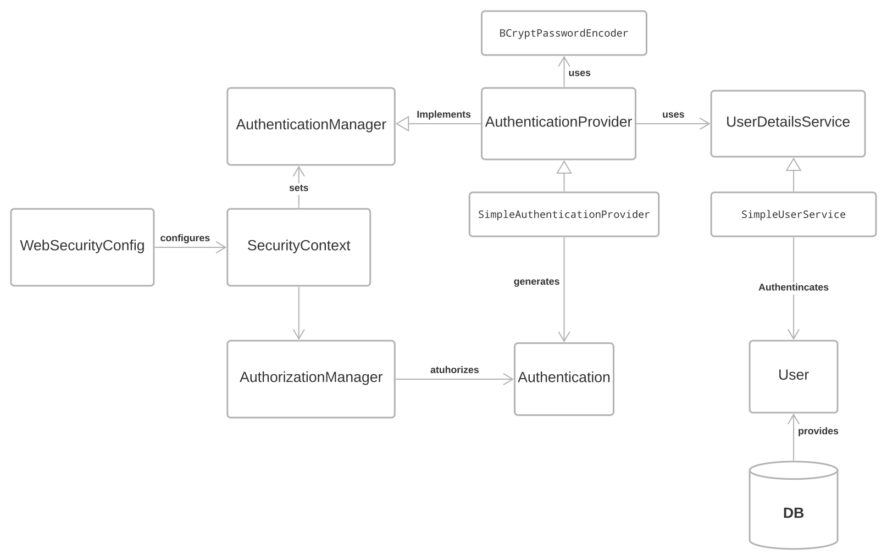

# T Sanchez' Spark MVC - Sprank

- [T Sanchez' Spark MVC - Sprank](#t-sanchez-spark-mvc---sprank)
  - [Spark](#spark)
  - [About Sprank](#about-sprank)
    - [Features](#features)
  - [Getting Started](#getting-started)
    - [**How does it all work?** TLDR:](#how-does-it-all-work-tldr)
    - [**What do I have to do?** / **Quick Start**](#what-do-i-have-to-do--quick-start)
    - [There are a lot of folders! Where do I start?](#there-are-a-lot-of-folders-where-do-i-start)
      - [Your project](#your-project)
    - [MVC package](#mvc-package)
      - [Controller](#controller)
      - [View](#view)
      - [Model](#model)
      - [Lifecycle](#lifecycle)
    - [Database package](#database-package)
      - [Persistent Entity](#persistent-entity)
      - [Persistent Entity Set](#persistent-entity-set)
  - [Going Further](#going-further)
    - [Routing](#routing)
    - [Request Mapping](#request-mapping)
    - [TS' Spark Security](#ts-spark-security)
      - [Authentication](#authentication)
        - [AuthenticationManager](#authenticationmanager)
        - [AuthenticationProvider](#authenticationprovider)
        - [UserDetailService](#userdetailservice)
      - [Authorization](#authorization)
        - [Authorization Manager](#authorization-manager)
        - [GrantedAuthority](#grantedauthority)
        - [Spark Authorization Filter](#spark-authorization-filter)
      - [Authorities](#authorities)
      - [Securing Endpoints](#securing-endpoints)
    - [Internationalization](#internationalization)
  - [Credits](#credits)
  - [License](#license)


## Spark

Please, visit Spark [website](https://sparkjava.com/) for documentation about it.
See also its public [repository](https://github.com/perwendel/spark)

Spark - A micro framework for creating web applications in Kotlin and Java 8 with minimal effort

## About Sprank

Tomas Sanchez Spark MVC implementation: Sprank, is the result of improving an assigment for __UTN FRBA__, Systems Design Course where it consist of developing a simple web application using an MVC pattern with `Spark Java` and `JPA`. Having [`Bootstrap 5`](https://getbootstrap.com/docs/5.0/getting-started/introduction/) and `HandleBars` for front-end developing.
<br></br>
The seed provides a minimal set up to arrage your project so you can create a web application with **even less** effort.
<br></br>
If you are developing the System Design assignment I highly recommend taking a look at this seed, it will provide a good inspiration and can be a reference for your project.

__DISCLAIMER__: using this seed __DOES NOT__ guarantee passing the assignment, nor developers account for responsibility in case of wrong usage of interfaces provided.

### Features

- Project structure: a guideline and convention to better organization.
- Model View Controller pattern: you don't have to code a MVC design yourself.
  - Automatic instantiation and initialization of controllers.
  - Views are automatically binded to a controller.
  - Example controllers provided.
  - Base foundational controller with convenience methods.
- Database
  - Good practices
  - Persistent entity provided for entity standarization.
  - Crud repository interface
  - Transactional services example
- Front End Templates: easily to extend with HandleBars.
  - Distinguish your project with Material Design for Bootstrap (MDB)
  - Automatic Navigation activation.
  - In model endpoints.
  - User profile & roles automatic Navbar handling.
  - Internationalization support.
- Security
  - User - Role - Privileges
  - Log In and Register
  - Session token
  - Easy to secure endpoints with @Secured anotattion

<br></br>

## Getting Started

### **How does it all work?** TLDR:

The `Controller` has a `View` which contains a `Model`, the `ViewModel`. You should manipulate this `ViewModel` to reflect changes on your view, when a request is being responded. Your controller will be automatically instantiate by the `ControllerLoaderService` as long as it inherits from `Controller`  class and it is located inside the `controller` package (not the `core.mvc.controller` package), so you don't need to worry about initialization, nor trying to use a _singleton_ approach. With this a `View` and a`ViewModel` will be automatically initializated, ready to be modified according to your needs.

<br></br>

### **What do I have to do?** / **Quick Start**

- Create a new `class ExampleController extends Controller` inside the `controller` package (not the `core.mvc.controller` package)
- Create a new `file Example.html.hbs` with the same name as your controller. Ex. _`ToDoController`_, and _`ToDo.html.hbs`_ (case sensitive)
- Create a method that returns a `ModelAndView`, and takes the spark's `Request` and `Response` objects  in the controller with the annotation `@GetMapping`. Ex:
  ```java
    @GetMapping
    public ModelAndView onShowPage(Request request, Response response){
        return getModelAndView();
    }
  ```
- Run `main` in `Router` class.
- Open your browser on localhost:7070/'ControllerName'. Ex. _`ToDoController`_, and _`ToDo.html.hbs`_ will be displayed at `/todo` endpoint

<br></br>

<hr/>

<br></br>
### There are a lot of folders! Where do I start?

The **`core`** package represents the fundamental components of this seed. There you will find a `mvc` _package_ where the `Model View Controller` is implemented.

`database` _package_ contains abstract convenience super classes which will help you with the model design.

`services` _package_ includes implementations used during run-time.

The most notorious are shown bellow:


There is no need for you to worry about the `core` package, _it just works_. Modifyng it may require some understanding of the MVC pattern and the seed itself.

#### Your project

This seed proposes the following package structure:

- Your package
    - app
      - seeder
    - config
    - controller
    - model
      - user
    - repository
    - services
    - security
      - auth
      - filter
      - services

**app**: here it is recommended to initialize the server. Note: this is already provided in the `Application` class.

**config**: use this package to develop your own `@Configuration` classes a security configuration is already provided.

**controller**: use this package to group the different controllers classes.

**model**: it is recommended to develop entities in this package.

**repository**: use this package for Domain objects collections

**services**: optional split code your controller business-logic and interaction with a specific respository. For example: if you need to send an e-Mail to users during registration, instead of coding this logic on a `RegistrationController` you can do it in a `UserService` which your controller will make use of.

**security**: develop yout custom security services and filters.

NOTE: As per [Eric Evans' book Domain-Driven Design](https://www.pearson.com/store/p/domain-driven-design-tackling-complexity-in-the-heart-of-software/P100000775942/9780321125217), the “_repository is a mechanism for encapsulating storage, retrieval, and search behavior, which emulates a collection of objects_.” Likewise, according to [Patterns of Enterprise Application Architecture](https://www.pearson.com/store/p/patterns-of-enterprise-application-architecture/P100001391761/9780321127426#), it “mediates between the domain and data mapping layers using a collection-like interface for accessing domain objects.”

<br></br>
### MVC package

This seed `MVC` implementation was designed for the specific case of developing a Server-Side-Rendered Web Application, However it does support the use case of REST API.

#### Controller

The **`Controller`** class is a generic implementation. Your controllers must inherit this class. By default all controllers are set to the path `/controllername` with the method [`GET`](https://developer.mozilla.org/en-US/docs/Web/HTTP/Methods), and if a [`TemplateEngine`]((https://sparkjava.com/documentation#views-and-templates)) is set, it executes a _method_ that responses with a [`ModelAndView`](https://sparkjava.com/documentation#views-and-templates).

**IMPORTANT** all controllers must be inside of the `your.package.controller` package (not `your.package.core.mvc.controller`). And **DO NOT** create multiple controller packages.


Suppose you want to display a new "`HelloPage`", in order to achieve this, you must create a new controller:

```java
public class HelloController extends Controller {

    /* =========================================================== */
    /* Lifecycle methods ----------------------------------------- */
    /* =========================================================== */

    @Override
    protected void onInit() {
        // TODO Auto-generated method stub
    }

    @Override
    protected void onBeforeRendering(Request request, Response response) {
        // TODO Auto-generated method stub

    }

    @Override
    protected void onAfterRendering(Request request, Response response) {
        // TODO Auto-generated method stub

    }

}
```

When extending the `Controller` class you will need to define the `lifecycle` methods, which we will talk about later. Now ignore this, just know that you must only provide the override definition, as no behaviour is really needed.

Then to set up the endpoint you must use the provided annotations as shown bellow:

```java
public class HelloController extends Controller {

    /* =========================================================== */
    /* HTTP Request methods -------------------------------------- */
    /* =========================================================== */

    @GetMapping
    public ModelAndView showHelloPage(Request request, Response response){
        return getModelAndView();
    }

}
```

Then by the controller means, you are all set. The `@GetMapping` will set enable _GET_ requests with the `showHelloPage` method as handler. 

These handler methods must return a `ModelAndView` object (_unless_ the `engine` is set to `false`), and take `spark.Request` and `spark.Response` as parameters.

For convenience a method `getModelAndView()` is provided in the Controller superclass, this method will retrieve the handlebars' file. You do not need to modify anything, as long as you **respect the naming convention** of this seed.

<br></br>

#### View

The **`View`** class provides a layer of abstraction, representing the logic behind the matching and mapping of an `<HTML/>` file. It contains a `Model`, which will be refered as `ViewModel`, this will allow you to reflect the changes in the _actual_ view, the UI. There is a `one-to-one` relation between `Controller` and `View`.

If you want to display your controller view, a web-page, you will need a [`HandleBars`](https://handlebarsjs.com/guide/) file which name should be `<ControllerName>.html.hbs` for this case: `HelloController` must have `Hello.html.hbs` in the directory `main/resources/templates`. 

**Note**: Each `Controller` has its own `View` instance, this `View` is loaded from `main/resources/template/` from the file `controllername.html.hbs`. For example your `HelloController` would send an html made from the `Hello.html.hbs` template. The naming is case sensitive, so `hello.html.hbs` won't work out of the box. See how `NotFoundController` has a `NotFound.html.hbs` view file.

<br></br>

A `View` example using the included layout of Bootstrap-navbar: `Hello.html.hbs`

```hbs
{{#partial "pageTitle"}}
    {{i18n.hellloWorld}}
{{/partial}}

{{#partial "content"}}
    <!-- ======= Hero Section ======= -->
    <main id="hero" class="container overflow-auto">
      <div class="container col-xxl-8 px-4 py-5">
        <div class="row flex-lg-row-reverse align-items-center g-5 py-5">
            <div class="col-10 col-sm-8 col-lg-6 mx-auto">
                
            </div>
            <div class="col-lg-6">
            <h1 class="display-5 fw-bold lh-1 mb-3">{{i18n.hellloWorld}}</h1>
            <p class="lead">{{i18n.lorem}}</p>
            <div>
              <button type="button" class="btn btn-primary btn-lg px-4 me-md-2">
                Demo
              </button>
              <a type="button" class="btn btn-outline-primary btn-lg px-4" href="https://tomasanchez.github.io">
                About
              </a>
            </div>
          </div>
        </div>
      </div>
    </main>
{{/partial}}
{{> layouts/Bootstrap-Navbar.html.hbs }}
```

Now you can visualize your `Hello.html.hbs` file at <a>https://localhost:7070/hello</a>

<br></br>

#### Model

The **`Model`** is another abstraction, also refered here as **`ViewModel`**, in this case of a `Map<String, Object>`, providing convenience methods such as instantiation via `JSON` or `Properies` _file_. Model also provides fluent setter for properties, and can be joined with other models (puts one map into another).
This `ViewModel` is used to reflect changes in the User interface.


**Note**: Each `View` has a `Model` instance. In addition a `Model` can contain another `Model` within. As a `Controller` has a `View` which contains a `ViewModel`, controllers will have different `ViewModel` instances, however there is a **shared `ViewModel`** among them.


```hbs
<input
  name="password"
  type="password"
  class="form-control {{isValid}}"
  id="form-password"
  placeholder="Enter your password"
  required="true"
/>
```

`{{isValid}}` is a property of the `ViewModel` which can be set/unset by its corresponding controller, in this scenario it is used to modify a `Bootstrap 5` class for the `input form-control`, the `is-invalid` which alerts an error message when set.

All `ViewModel` properties should be set/unset from the corresponding `Controller` As shown bellow:

```java
public class LoginController extends Controller{

    @PostMapping
    public ModelAndView onLogIn(Request request, Response response){

        if(passwordIsWrong(request.queryParams("password"))){
            this.getView().getModel().set("isValid", "is-invalid");
        }

        return getModelAndView();
    }
}
```

**NOTE**: when reloading page the `ViewModel` is reset to a blank state.

<br></br>

#### Lifecycle

You should override this **`LifeCycle`** methods, implementating the lifecycle of the `ViewModel`. However, you can leave them empty, and will work just as well, without any logic.


```java

    /* =========================================================== */
    /* Lifecycle methods ----------------------------------------- */
    /* =========================================================== */

    /**
     * This method is called upon initialization of the View. The controller can perform its
     * internal setup in this hook. It is only called once per View instance, unlike the
     * onBeforeRendering and onAfterRendering hooks.
     */
    protected abstract void onInit();

    /**
     * 
     * This method is called every time the View is rendered, before the Renderer is called and the
     * HTML is placed in the DOM-Tree. It can be used to perform clean-up-tasks before re-rendering.
     * 
     * @param request the Spark HTTP request object
     * @param response the Spark HTTP response object
     */
    protected abstract void onBeforeRendering(Request request, Response response);

    /**
     * 
     * This method is called every time the View is rendered, after the HTML is placed in the
     * DOM-Tree. It can be used to apply additional changes to the Model after the Renderer has
     * finished.
     * 
     * @param request the spark HTTP request object
     * @param response the spark HTTP response object
     */
    protected abstract void onAfterRendering(Request request, Response response);
```

A recommended implementation is use this methods to add logic before the View is rendered and after it has been rendered.
Continuing the example of above, as the `Model` does not refresh by itself, you should _clean up_ the model in the `onAfterRenderingMethod`, not before as it will not be rendered, due to properties overriding, but for the next request, the model will be _clean_. 

```java
public class LoginController extends Controller{

    @Override
    protected void onAfterRendering(Request request, Response response){
        this.getView().getModel().set("isValid", "");
    }

    @PostMapping
    public ModelAndView onLogIn(Request request, Response response){

        if(passwordIsWrong(request.queryParams("password"))){
            this.getView().getModel().set("isValid", "is-invalid");
        }

        return getModelAndView();
    }
}
```

By doing this, when reloading the page, the field will no longer be `is-invalid`.

### Database package

#### Persistent Entity

The seed provides you with a `PersistentEntity` class which _should_ be extended by your use case entities which will be persisted in a database. This is only a generic class with convenience attributes for an entity's `Id` and generation of them. See how the [`User`](https://github.com/tomasanchez/jpa-template/blob/82a257b1cbc0b9fe41a437ef5dc9590c928d6534/src/main/java/com/jpa/model/user/User.java#L19) class extends `PersistentEntity`.

```java
@MappedSuperclass
public abstract class PersistentEntity implements Serializable {

    @Id
    @GeneratedValue(generator = "uuid")
    @GenericGenerator(name = "uuid", strategy = "uuid2")
    @Column(name = "id", updatable = false, nullable = false)
    private String id;

}
```

You can easily create your own entity as

```java
@Entity
@Table(name = "students", uniqueConstraints = {@UniqueConstraint(columnNames = {"email"})})
public class Student extends PersistentEntity{

    @Column(name = "name")
    private String name;

    @Column(name = "email")
    private String email;
}
```

> Recommendation: it is a _good practice_ to define the column name for your entities and for your table.

#### Persistent Entity Set

In addition, there is a `PersistentEntitySet<T extends PersistentEntity>` generic superclass, which allows you to easily create `CRUD Repositories`, as you **DO NOT NEED** to implement them yourself. However, for better performance or special use cases, it is recommended to override them.

The interface provided:

```java
public abstract class PersistentEntitySet<T> implements WithGlobalEntityManager {

    /**
     * Retrieves Table name (class name).
     * 
     * ? Example: PersistentEntitySet<User> => Table name is User
     * 
     * @return the table name
     */
    protected String getTableName();

    /**
     * Obtains all entities in the database.
     * 
     * @return an entity list.
     */
    public List<T> getEntitySet();

    /**
     * Persists an entity in database.
     * 
     * @param entity to be persisted
     * @return persisted entity
     */
    public T createEntity(T entity);
    

    /**
     * Obtains a single entity.
     * 
     * @param id the entity unique id
     * @return entity or null.
     */
    public Optional<T> getEntity(long id);

    /**
     * Updates the database with the entity.
     * 
     * @param entity to be updated
     * @return the updated entity
     */
    public T updateEntity(T entity);

    /**
     * Updates the database with the entity.
     * 
     * @param id the entity's unique id
     * @return the updated entity
     */
    public T updateEntity(Long id);

    /**
     * Removes an entity from database.
     * 
     * @param entity the entity to be deleted
     */
    public void deleteEntity(T entity);

    /**
     * Removes an entity from database.
     * 
     * @param id the entity unique id
     */
    public void deleteEntity(Long id);
}
```

**NOTE**: You can easily add your own custom implementation in a child class.

See this case of `UserRepository`

```java
public class StudentRepository extends PersistentEntitySet<Student> {

    // No need to implement the aforementioned PersistentEntitySet methods. nor override them.

    /**
     * Obtains an student from database that matches the given email.
     * 
     * @param email to match
     */
    public Optional<Student> findByEmai(String email){

        try{
            return Optional.of(
                                (Student) entityManager()
                                                .createQuery(String.format("FROM %s S WHERE S.email LIKE :email"))
                                                .setParameter("email", email)
                                                .getSingleResult()
                            );
        }catch(Exception e){
            return Optional.empty();
        }
    }
}
```


<br></br>

## Going Further

### Routing

This seed contains 2 (two) views, `Home` and `LogIn` and a custom `Not Found` mapped view. Note that each view has its own controller, and all of these inherit from a `BaseController`. This controller has no associated view, as it is purely an implementation of shared methods and convenience shortcuts.

In this seed, used for developing assignments in `UTN-FRBA`, the `BaseController` implements `WithGlobalEntityManager, TransactionalOps`, interface provided by professors of the course [`System's Design`](https://dds-jv.github.io/), which includes convenience methods for transactional operations.

<br></br>


<br></br>

### Request Mapping

As shown in the `Spark` [routing-documentation](https://sparkjava.com/documentation#routes), it offers an _easy_ way to create a route.

With three pieces: 
- verb (get, post, put, delete, etc...)
- A path (/,  /home, /users/:id)
- A callback method

```java
Spark.get("/", (request, response) ->{});
```

However, for Server-Side rendering you will also need a `TemplateEngine`. And your callback method should return a `ModelAndView`. So it becomes not that simple.

```java
Spark.get("/", (req, res) ->{
    return new ModelAndView(new HashMap<>(), "filePath.hbs");
},
new HandleBarsTemplateEngine());
```

When using a controller...

```java
TemplateEngine hte = new HandleBarsTemplateEngine();
HomeController home = new HomeController();
Spark.get("/home", home::handleGETMethod, hte);
```

Even though this looks cleaner, it leads to the problem of keeping track of the TemplateEngine, controllers instances, literal path. This aggravates when having multiple controllers, with multiple methods even for the same Request method.

Where it can lead to something like:

```java
TemplateEngine hte = new HandleBarsTemplateEngine();
HomeController home = new HomeController();
UsersController users = new UsersController();
ToDosController todos = new ToDosController();
LoginController login = new LoginController();
RegisterController register = new RegisterController();
// And so on...
Spark.get("/home", home::handleGETMethod, hte);
Spark.get("/home/:id", home::handleGETWithIDMethod, hte);
Spark.post("/home", home::handlePostMethod, hte);
Spark.post("/home/:id", home::handlePostWithIdMethod, hte);
// And so on...
```

Now deleting, or altering any route will be a nightmare, with a very poor legibility. Even JSON or any other MediaType response routing requieres a `ResponseTransformer`.

In order to simplify and offer better legibility, inspired by the `SpirngBoot` framework, this seed contains `@interfaces` which will do the mapping for you.

The provided annotations are:

```java
/**
 * Annotation for mapping HTTP GET requests onto specific handler methods.
 * 
 * @author Tomás Sánchez.
 */
@Retention(RetentionPolicy.RUNTIME)
@Target(ElementType.METHOD)
public @interface GetMapping {

    /**
     * The path of the endpoint.
     * 
     */
    String path() default "";

    /**
     * Wether a Template engine should be used or not.
     */
    boolean engine() default true;
}

/**
 * Annotation for mapping HTTP POST requests onto specific handler methods.
 */
@Retention(RetentionPolicy.RUNTIME)
@Target(ElementType.METHOD)
public @interface PostMapping {

    /**
     * The path of the endpoint.
     * 
     */
    String path() default "";

    /**
     * Wether a Template engine should be used or not.
     */
    boolean engine() default true;
}

/**
 * Annotation for mapping HTTP DELETE requests onto specific handler methods.
 */
@Retention(RetentionPolicy.RUNTIME)
@Target(ElementType.METHOD)
public @interface DeleteMapping {

    /**
     * The path of the endpoint.
     * 
     */
    String path() default "/:id";

}


/**
 * Annotation for mapping HTTP PUT requests onto specific handler methods.
 */
@Retention(RetentionPolicy.RUNTIME)
@Target(ElementType.METHOD)
public @interface PutMapping {

    /**
     * The path of the endpoint.
     * 
     */
    String path() default "/:id";

}
```


The `@GetMapping` will map GET request to the specified `path` or **DEFAULTS** in the controller _endpoint_ which is `/<controllerName>`, there is also an additional parameter: engine which by default will be _true_: this determines wether the response is an html or not. When _true_, function should return a `ModelAndView`, when _false_ it  is recommended to return a serializable object as a `ResponseTransformer` will be used to adapt the response to JSON type.


**IMPORTANT** doing a request mapping as shown bellow:

```java
public class HomeController extends Controller {

    /* =========================================================== */
    /* HTTP Request methods -------------------------------------- */
    /* =========================================================== */

    @GetMapping(path="homepage")
    public ModelAndView showHomePage(Request request, Response response){
        return getModelAndView();
    }

}
```

Will result in setting a `GET` endpoint on `/home/homepage`.

The same rule applies to `@PostMapping`. However, `@DeleteMapping` and `@PutMapping` do not use the engine logic, for both is recommended to return an object.

As shown below:

```java

public class UsersControlller extends Controller{

    /* =========================================================== */
    /* HTTP Request methods -------------------------------------- */
    /* =========================================================== */

    @DeleteMapping
    public Object onDeleteUser(Request request, Response response){
        userService.delete(request.params("id"));
        return null;
    }

    @PutMapping
    public Object onDeleteUser(Request request, Response response){
        return userService.update(request.params("id"), request.queryParams("user"));
    }

}
```

**NOTE**: both `@DeleteMapping` and `@PutMapping` will use the default path `users/:id`.


> **RECOMENDATION**: If you need to delete/update from a **`form`** a easy way I found is to make a `POST` with a flag which indicates wheter it is a post, a delete or an update. This wil allow you to return a `ModelAndView`. Using `JavaScript`,  `fetch()` an when returning reload the window, this will reflect the changes in the `ViewModel`, but this requires preventing form default behaviour and using a custom implementation. 

<br></br>

### TS' Spark Security

Tomas Sanchez's Spark Security implementation was designed inspired on [Spring Security](https://spring.io/projects/spring-security)


Read more about Spring Security from the [source](https://www.tutorialspoint.com/spring_security/spring_security_form_login_with_database.htm).

<br></br>

Following this, idea the Spark Architecture:



#### Authentication

`Authentication` is the process of verifying who someone is.

There is a provided interface to express this:

```java
public interface Authentication extends Principal, Serializable {

    /**
     * Indicates the authorities that the principal has been granted.
     * 
     * @return the authorities granted to the principal or an empty collection.
     */
    Collection<? extends GrantedAuthority> getAuthorities();

    /**
     * Usually a password, but could be anything relevant to the <code>AuthenticationManager</code>.
     * Callers are expected to populate the credentials.
     * 
     * @return the credentials that prove the identity of the <code>Principal</code>
     */
    Object getCredentials();

    /**
     * The identity of the principal being authenticated. In the case of an authentication request
     * with username and password, this would be the username.
     * 
     * @return the principal identity.
     */
    Object getPrincipal();

    /**
     * Indicates wether the authentication is validated or not.
     * 
     * @return true if the token has been authenticated
     */
    boolean isAuthenticated();

    /**
     * 
     * @param isAuthenticated <code>true</code> if the token should be trusted (which may result in
     *        an exception) or <code>false</code> if the token should not be trusted
     * 
     */
    void setAuthenticated(boolean isAuthenticated);
}
```

In this design, the `AuthenticationProvider` produces `Authentications` and the `AuthorizationManager` consumes them.

##### AuthenticationManager

This interface incapsulates the logic behind the authentication process. It is the main strategy. It uses the lone method `authenticate()` to authenticate an `Authentication` object. 

##### AuthenticationProvider

It is an implementation of the `AuthenticationManager`, so this must support the method `authenticate()`. With this, the process of authentication is started. It has the responsibility of retrieving an `UserDetail`. **NOTE**: this user detail is not the one provided in the `model` package, when developing your own `User` class you must provide an specific adapter to transform your `User class` to `UserDetail`.

If the user is not found, it can throw a `UsernameNotFoundException`. On the other hand, if the user is found, then the authentication details of the user are used to authenticate the user, creating an `Authentication` object.

This seed **provides you with an implementation** the `SimpleAuthenticationProvider` class, located in the `security.auth` package, which utilizes the default password encoding, the `BCryptPasswordEncoder`, based on the [`bcrypt`](https://en.wikipedia.org/wiki/Bcrypt) password-hashing function, this means it is the responsible of **matching passwords**.

This provided interface allows you to develop your custom `Authentication` process. In this seed implements a JSON Web Token (JWT) Authentication.

##### UserDetailService

This class is should be an specific implementation of the mapping from your `User` model entity to the utilized `UserDetail`. It is the bridge between your database and the authentication process.

Should implement the lone method of `loadUserByUsername()`, which retrieves an User of your model and transforms it into a `UserDetail`.

This seed **provides you with an implementation** the `SimpleUserService`, located in the `security.services` package.

#### Authorization

`Authorization` is the process of verifying what specific applications, files, and data a user has access to.

##### Authorization Manager

Similar to `AuthenticationManager`, this interface incapsulates the authorization process. Its interface is the method `authorize()` which verifies wether an `Authentication` is valid or not.

##### GrantedAuthority

An `UserDetails` has a Collection of `GrantedAuthority` objects, these determine wether the user has access to an specified resource.

This is a simple interface with the sole method of `getAuthority()`.

```java
/**
 * A representation of an authority given to an user.
 */
public interface GrantedAuthority extends Serializable {

    /**
     * An authority must be represented by a string.
     * 
     * @return the granted authority
     */
    String getAuthority();
}
```

##### Spark Authorization Filter

It is a Spark specific implementation of before Filters for the autorization process.

```java
/**
 * Generic Interface for authorization filter in Spark.
 * 
 * @author Tomás Sánchez
 */
public interface SparkAuthorizationFilter {

    /**
     * Session Authorization filter.
     * 
     * @param request the Spark HTTP request object
     * @param response the Spark HTTP response object
     * @param authorities a list of required authorities
     * @throws UnauthorizedException when no session was found or token has expired.
     * @throws ForbiddenException when current user is not authorized
     */
    public void authorizationFilter(Request request, Response response,
            Collection<GrantedAuthority> authorities);
}
```

When there is no session or it has expired, `UnauthorizedException` is thrown. When the current user is not authorized, a `ForbiddenException` is thrown. **It is the responsibility of the developer to `catch` these exceptions with `Spark.exception()` handler**.

**This project includes** an implementation for using a JWT in a Spark Session, `SessionJwtAuthorizationFilter`, and **a global exception handler** for both `UnauthorizedException` and `ForbiddenException`.

#### Authorities

There is a hierarchical `Role`-`Privilege` system, in which a `Role` has many `Privileges` (many-to-many relationship).

This was based on [Baeldung's Spring Security – Roles and Privileges](https://www.baeldung.com/role-and-privilege-for-spring-security-registration)


For simplification, an `User` has only one `Role` (Many-To-One), and these Roles are organized hirearchally resulting in:


So, assigning the **role ADMIN automatically gives the user the privileges of both the STAFF and USER roles**.

However, a user with the role STAFF can only perform STAFF and USER role actions.

In addition to reflect this on the DB, each `Role` has an intrinsic `Privilege` which results in a `ROLE_<ROLE_NAME>` as a `Privilege`.

Eg. `Admin: Role`, has a `ROLE_ADMIN: Privilege`

#### Securing Endpoints

There is an `@interface` provided to easily restric access to different request handler methods, `@Secured`.

```java
@Retention(RetentionPolicy.RUNTIME)
@Target(ElementType.METHOD)
public @interface Secured {

    /**
     * Allow access only to given roles or authorities. When no authorities are set, allows access
     * only when session is authenticated.
     * 
     * <br>
     * </br>
     * 
     * Recommended to use a role hirearchy to better organization.
     */
    String[] roles() default {};
}
```

Eg. `AdminController` has a `View` which should be only accessible for users with the `ROLE_ADMIN` authority.

```java
public class AdminController extends Controller {

    /* =========================================================== */
    /* Lifecycle methods ----------------------------------------- */
    /* =========================================================== */
    
    // ...

    /* =========================================================== */
    /* Request Handling ------------------------------------------ */
    /* =========================================================== */

    @GetMapping
    @Secured(roles = "ROLE_ADMIN")
    public ModelAndView index(Request request, Response response) {
        return getModelAndView();
    }
}
```


`@Secured` annotattion **MUST** be used along with a `@<Method>Mapping` anotattion, because this last one determines the `path` where the `SparkAuthorizationFilter` will be added. 

In this case, `@Secured` forbids `GET` request on the `/admin` path to all `User` entities which **DO NOT** have the `Privilege` of `ROLE_ADMIN`.

**NOTE**: All other request handlers for **different methods** will not be afected. Eg. to restricts `POST` request, another `@Secured` anotattion should be used alongside the `@PostMapping`. 

<hr/>

### Internationalization

There is a custom implementation of a `ResourceBundle`, it requires a `.properties` file located in `/resources/locales/`, and also to be named as it follows: `i18n-{ISO 639-1}.properties`. See [`ISO 639-1`](https://en.wikipedia.org/wiki/List_of_ISO_639-1_codes) for further information. 

These properties will be loaded automatically into a model, available for the controller, an so its view. 

Being your `i18n-en.properties` file:

```properties
inputLabel=An Input label
inputPh=Insert a text
```

Therefore, you can access these translations from a view this way:

```hbs
<label>{{i18n.inputLabel}}</label>
<input
 placeholder="{{i18n.inputPh}}"
/>
```

Which will result in:

```hbs
<label>An Input label</label>
<input
 placeholder="Insert a text"
/>
```

For each controller, before `onBeforeRendering`, the request's header [`Accept-Language`](https://developer.mozilla.org/en-US/docs/Web/HTTP/Headers/Accept-Language) will be evaluated, if it is the same as the current used, there will be no changes, otherwise, there will be a try to load the requested language from a `.properties` file, if it exists, else the default language will be used.

Following the previous example, if the `Accept-Language` header switchs to `es`, and there is a `i18n-es.properties`:


```properties
inputLabel=Una etiqueta
inputPh=Ingrese un texto
```

Will result in:

```hbs
<label>Una etiqueta</label>
<input
 placeholder="Ingrese un texto"
/>
```

## Credits

This project was facilitated with 💙 by [Tomas Sanchez](https://github.com/tomasanchez).

## License

All material is provided under an MIT License unless otherwise specified.

MIT License: <https://mit-license.org/> or see the [`LICENSE`](https://github.com/tomasanchez/jpa-template/blob/main/LICENSE) file.
