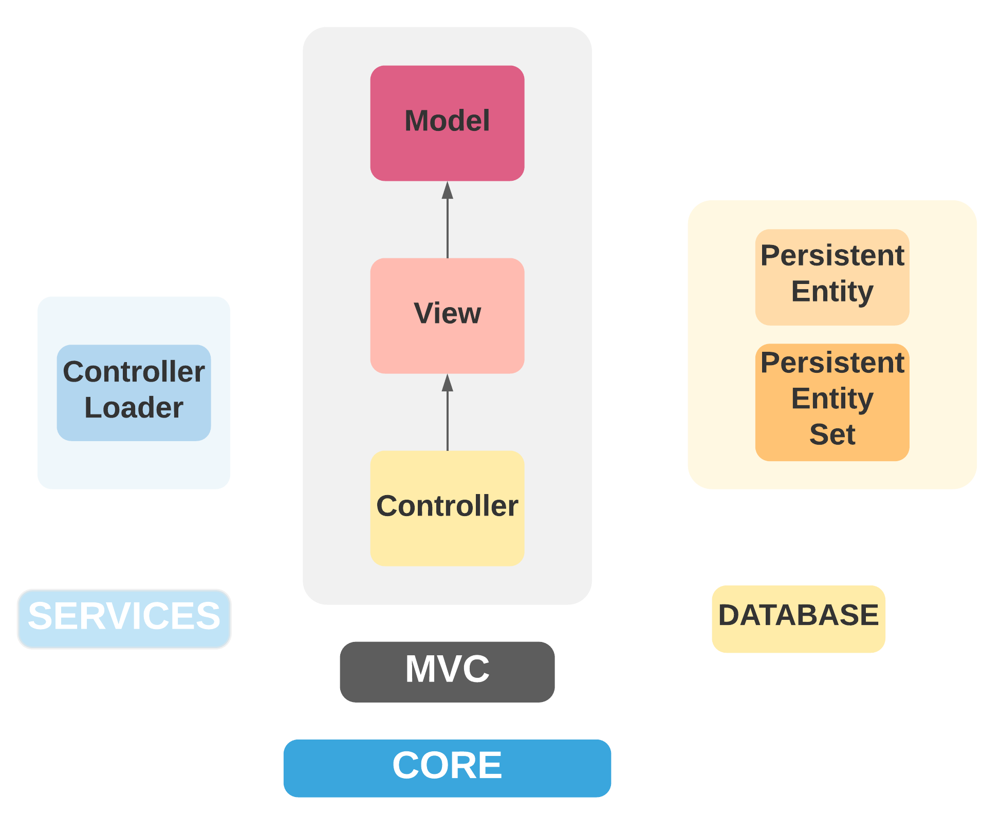
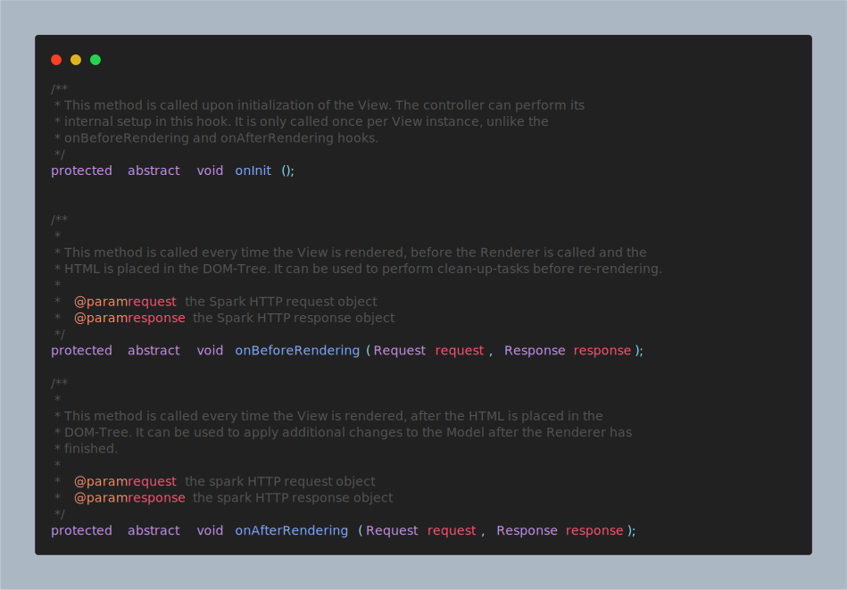
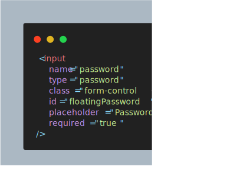
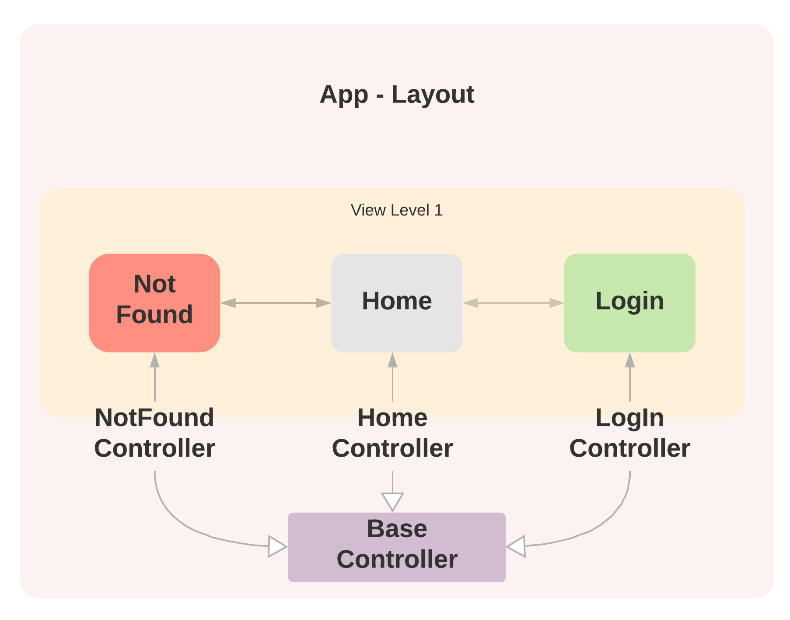

# T Sanchez's Spark Seed

- [T Sanchez's Spark Seed](#t-sanchezs-spark-seed)
  - [Spark](#spark)
  - [About this seed](#about-this-seed)
  - [Getting Started](#getting-started)
    - [**How does it all work?** TLDR:](#how-does-it-all-work-tldr)
    - [**What do I have to do?** / **Quick Start**](#what-do-i-have-to-do--quick-start)
    - [There are a lot of folders! Where do I start?](#there-are-a-lot-of-folders-where-do-i-start)
    - [MVC package](#mvc-package)
      - [Controller](#controller)
      - [View](#view)
  - [Going Further](#going-further)
    - [Routing](#routing)
    - [Database](#database)
    - [Internationalization](#internationalization)
  - [License](#license)


## Spark

Please, visit Spark [website](https://sparkjava.com/) for documentation about it.
See also its public [repository](https://github.com/perwendel/spark)

Spark - A micro framework for creating web applications in Kotlin and Java 8 with minimal effort

## About this seed

This seed is the result of improving an assigment for __UTN FRBA__, Systems Design Course where it consist of developing a simple web application using an MVC pattern with `Spark Java` and `JPA`. Having [`Bootstrap 5`](https://getbootstrap.com/docs/5.0/getting-started/introduction/) and `HandleBars` for front-end developing.
<br></br>
The seed provides a minimal set up to arrage your project so you can create a web application with minimal effort.
<br></br>
If you are developing the System Design assignment I highly recommend taking a look at this seed, it will provide a good inspiration and stating point.

__DISCLAIMER__: using this seed __DOES NOT__ guarantee passing the assignment, nor developers account for responsibility in case of wrong usage of interfaces provided.

<br></br>

## Getting Started

### **How does it all work?** TLDR:

The `Controller` has a `View` which contains a `Model`, the `ViewModel`. You should manipulate this `ViewModel` to reflect changes on your view, when a request is being responded. Your controller will be automatically instantiate by the `ControllerLoaderService` as long as it inherits from `Controller`  class and it is located inside the `controller` package (not the `core.mvc.controller` package), so you don't need to worry about initialization, nor trying to use a _singleton_ approach. With this a `View` and a`ViewModel` will be automatically initializated, ready to be modified according to your needs.

<br></br>

### **What do I have to do?** / **Quick Start**

- Create a new `class ExampleController extends Controller` inside the `controller` package (not the `core.mvc.controller` package)
- Create a new `file Example.html.hbs` with the same name as your controller. Ex. _`ToDoController`_, and _`ToDo.html.hbs`_ (case sensitive)
- Create a method that returns a `ModelAndView`, and takes the spark's `Request` and `Response` objects  in the controller with the annotation `@GetMapping`. Ex:
  ```java
    @GetMapping
    public ModelAndView onShowPage(Request request, Response response){
        return getModelAndView();
    }
  ```
- Run `main` in `Router` class.
- Open your browser on localhost:7070/'ControllerName'. Ex. _`ToDoController`_, and _`ToDo.html.hbs`_ will be displayed at `/todo` endpoint

<br></br>

<hr/>

<br></br>
### There are a lot of folders! Where do I start?

The **`core`** package represents the fundamental components of this seed. There you will find a `mvc` _package_ where the `Model View Controller` is implemented.

`database` _package_ contains abstract convenience super classes which will help you with the model design.

`services` _package_ includes implementations used during run-time.

The most notorious are shown bellow:



<br></br>

There is no need for you to worry about the `core` package, _it just works_. Modifyng it may require some understanding of the MVC pattern and the seed itself.

### MVC package

#### Controller

This seed `Controller` implementation was designed for the specific case of developing a Server-Side-Rendered Web Application, How ever it does support the use case of REST API.

The **`Controller`** class is a generic implementation. Your controllers must inherit this class. By default all controllers are set to the path `/controllername` with the method [`GET`](https://developer.mozilla.org/en-US/docs/Web/HTTP/Methods), and if a [`TemplateEngine`]((https://sparkjava.com/documentation#views-and-templates)) is set, it executes a _method_ that responses with a [`ModelAndView`](https://sparkjava.com/documentation#views-and-templates).

**IMPORTANT** all controllers must be inside of the `your.package.controller` package (not `your.package.core.mvc.controller`). And **DO NOT** create multiple controller packages.


Suppose you want to display a new "`HelloPage`",in order to achieve this, you must create a new controller:

```java
public class HomeController extends Controller {

    /* =========================================================== */
    /* Lifecycle methods ----------------------------------------- */
    /* =========================================================== */

    @Override
    protected void onInit() {
        // TODO Auto-generated method stub
    }

    @Override
    protected void onBeforeRendering(Request request, Response response) {
        // TODO Auto-generated method stub

    }

    @Override
    protected void onAfterRendering(Request request, Response response) {
        // TODO Auto-generated method stub

    }

}
```

When extending the `Controller` class you will need to define the `lifecycle` methods, which we will talk about later. Now ignore this, just know that you must only provide the override definition, as no behaviour is really needed.

Then to set up the endpoint you must use the provided annotations as shown bellow:

```java
public class HelloController extends Controller {

    /* =========================================================== */
    /* HTTP Request methods -------------------------------------- */
    /* =========================================================== */

    @GetMapping
    public ModelAndView showHelloPage(Request request, Response response){
        return getModelAndView();
    }

}
```

Then by the controller means, you are all set. The `@GetMapping` will set enable _GET_ requests with the `showHelloPage` method as handler. 

These handler methods must return a `ModelAndView` object (_unless_ the `engine` is set to `false`), and take `spark.Request` and `spark.Response` as parameters.

For convenience a method `getModelAndView()` is provided in the Controller superclass, this method will retrieve the handlebars' file. You do not need to modify anything, as long as you **respect the naming convention** of this seed.

#### View

The `View` class represents an abstraction for the corresponding "page" associated with a controller. There is a `one-to-one` relation between `Controller` and `View`.

If you want to display your controller view, a web-page, you will need a [`HandleBars`](https://handlebarsjs.com/guide/) file which name should be `<ControllerName>.html.hbs` for this case: `HelloController` must have `Hello.html.hbs` in the directory `resources/templates`. 

**NOTE**: the naming is case sensitive, so `hello.html.hbs` won't work out of the box. Ex. `NotFoundController` has a `NotFound.html.hbs` view file.

A `View` example using the included layout of Bootstrap-navbar: `Hello.html.hbs`


```hbs
{{#partial "pageTitle"}}
    {{i18n.hellloWorld}}
{{/partial}}

{{#partial "content"}}
    <!-- ======= Hero Section ======= -->
    <main id="hero" class="container overflow-auto">
      <div class="container col-xxl-8 px-4 py-5">
        <div class="row flex-lg-row-reverse align-items-center g-5 py-5">
            <div class="col-10 col-sm-8 col-lg-6 mx-auto">
                
            </div>
            <div class="col-lg-6">
            <h1 class="display-5 fw-bold lh-1 mb-3">{{i18n.hellloWorld}}</h1>
            <p class="lead">{{i18n.lorem}}</p>
            <div>
              <button type="button" class="btn btn-primary btn-lg px-4 me-md-2">
                Demo
              </button>
              <a type="button" class="btn btn-outline-primary btn-lg px-4" href="https://tomasanchez.github.io">
                About
              </a>
            </div>
          </div>
        </div>
      </div>
    </main>
{{/partial}}
{{> layouts/Bootstrap-Navbar.html.hbs }}
```

Now you can visualize your `Hello.html.hbs` file at <a>https://localhost:7070/hello</a>

The `@GetMapping` will map GET request to the specified `path` or **DEFAULTS** in the controller _endpoint_ which is `/<controllerName>`, there is also an additional parameter: engine which by default will be _true_: this determines wether a web page should be responded, or not. When _true_, function should return a `ModelAndView`, when _false_ it  is recommended to return a string (JSON).


**IMPORTANT** doing a request mapping as shown bellow:

```java
public class HomeController extends Controller {

    /* =========================================================== */
    /* HTTP Request methods -------------------------------------- */
    /* =========================================================== */

    @GetMapping(path="homepage")
    public ModelAndView showHomePage(Request request, Response response){
        return getModelAndView();
    }

}
```

Will result in setting a `GET` endpoint on `/home/homepage`.

The same rule applies to `@PostMapping`. However, `@DeleteMapping` and `@PutMapping` do not use the engine logic, for both is recommended to return a JSON.

<br></br>

> **RECOMENDATION**: If you need to delete/update from a form the easiest way is to make a `POST` with a flag which indicates wheter it is a post, a delete or an update. This wil allow you to return a `ModelAndView`. Or if using `JavaScript`,  `fetch()` an when returning reload the window, this will reflect the changes in the `ViewModel`. 

<br></br>

**LifeCycle** methods.

You should override this methods, implementating the lifecycle of the `ViewModel`. However, you can leave them empty, and will work just as well, without any logic.



<br></br>

The **`View`** class provides a layer of abstraction, representing the logic behind the matching and mapping of an `<HTML/>` file. It contains a `Model`, which will be refered as `ViewModel`, this will allow you to reflect the changes in the _actual_ view, the UI.

**Note**: Each `Controller` has its own `View` instance, this `View` is loaded from `/resources/template/` from the file `controllername.html.hbs`. For example your `HomeController` would send an html made from the `HomeController.html.hbs` template.

<br></br>

The `Model` is another abstraction, in this case of a `Map<String, Object>`, providing convenience methods such as instantiation via `JSON` or `Properies` _file_. Model also provides fluent setter for properties, and can be joined with other models (puts one map into another).

**Note**: Each `View` has a `Model` instance. In addition a `Model` can contain another `Model` within. As a `Controller` has a `View` which contains a `ViewModel`, controllers will have different `Model` instances, however there is a shared `Model` among them.





`{{isValid}}` is a property of the `ViewModel` which can be set/unset by its corresponding controller, in this scenario it is used to modify a `Bootstrap 5` class for the `input form-control`, the `is-invalid` which alerts an error message when set.


<br></br>

## Going Further

<br></br>

### Routing

This seed contains 2 (two) views, `Home` and `LogIn` and a custom `Not Found` mapped view. Note that each view has its own controller, and all of these inherit from a `BaseController`. This controller has no associated view, as it is purely an implementation of shared methods and convenience shortcuts.

In this seed, used for developing assignments in `UTN-FRBA`, the `BaseController` implements `WithGlobalEntityManager, TransactionalOps`, interface provided by professors of the course [`System's Design`](https://dds-jv.github.io/), which includes convenience methods for transactional operations.

<br></br>



<br></br>

### Database

The seed provides you with a `PersistentEntity` class which can be extended by your use case entities which will be persisted in a database. This is only a generic class with convenience attributes for an entity's `Id`. See how the `User` class extends `PersistentEntity`.

```java
@MappedSuperclass
public abstract class PersistentEntity implements Serializable {

    @Id
    @GeneratedValue(generator = "uuid")
    @GenericGenerator(name = "uuid", strategy = "uuid2")
    @Column(name = "id", updatable = false, nullable = false)
    private String id;

}
```


In addition, there is a `PersistentEntitySet<T>` generic superclass, which allows you to easily create `CRUD Repositories`, as you **DO NOT NEED** to implement them yourself. However, for better performance or special use cases, it is recommended to override them.

The interface provided:

```java
public abstract class PersistentEntitySet<T extends PersistentEntity> implements WithGlobalEntityManager {

    /**
     * Retrieves Table name (class name).
     * 
     * ? Example: PersistentEntitySet<User> => Table name is User
     * 
     * @return the table name
     */
    protected String getTableName();

    /**
     * Obtains all entities in the database.
     * 
     * @return an entity list.
     */
    public List<T> getEntitySet();

    /**
     * Persists an entity in database.
     * 
     * @param entity to be persisted
     * @return persisted entity
     */
    public T createEntity(T entity);
    

    /**
     * Obtains a single entity.
     * 
     * @param id the entity unique id
     * @return entity or null.
     */
    public Optional<T> getEntity(long id);

    /**
     * Updates the database with the entity.
     * 
     * @param entity to be updated
     * @return the updated entity
     */
    public T updateEntity(T entity);

    /**
     * Updates the database with the entity.
     * 
     * @param id the entity's unique id
     * @return the updated entity
     */
    public T updateEntity(Long id);

    /**
     * Removes an entity from database.
     * 
     * @param entity the entity to be deleted
     */
    public void deleteEntity(T entity);

    /**
     * Removes an entity from database.
     * 
     * @param id the entity unique id
     */
    public void deleteEntity(Long id);
}
```

**NOTE**: You can easily add your own custom implementation in a child class.

See this case of `UserRepository`

```java
public class UserRepository extends PersistentEntitySet<User> {

    // No need to implement the aforementioned PersistentEntitySet methods. nor override them.

    /**
     * Obtains an user from database that matches the given username and password.
     * 
     * @param username to match
     * @param password to validate
     * @return A user (yet to be authenthicated)
     */
    public Optional<User> findByUsernameAndPassword(String username, String password);
}
```

<br></br>

### Internationalization

There is a custom implementation of a `ResourceBundle`, it requires a `.properties` file located in `/resources/locales/`, and also to be named as it follows: `i18n-{ISO 639-1}.properties`. See [`ISO 639-1`](https://en.wikipedia.org/wiki/List_of_ISO_639-1_codes) for further information. 

These properties will be loaded automatically into a model, available for the controller, an so its view. 

Being your `i18n-en.properties` file:

```properties
inputLabel=An Input label
inputPh=Insert a text
```

Therefore, you can access these translations from a view this way:

```hbs
<label>{{i18n.inputLabel}}</label>
<input
 placeholder="{{i18n.inputPh}}"
/>
```

Which will result in:

```hbs
<label>An Input label</label>
<input
 placeholder="Insert a text"
/>
```

For each controller, before `onBeforeRendering`, the request's header [`Accept-Language`](https://developer.mozilla.org/en-US/docs/Web/HTTP/Headers/Accept-Language) will be evaluated, if it is the same as the current used, there will be no changes, otherwise, there will be a try to load the requested language from a `.properties` file, if it exists, else the default language will be used.

Following the previous example, if the `Accept-Language` header switchs to `es`, and there is a `i18n-es.properties`:


```properties
inputLabel=Una etiqueta
inputPh=Ingrese un texto
```

Will result in:

```hbs
<label>Una etiqueta</label>
<input
 placeholder="Ingrese un texto"
/>
```

<br></br>

## License

All material is provided under an MIT License unless otherwise specified.

MIT License: <https://mit-license.org/> or see the [`LICENSE`](https://github.com/tomasanchez/jpa-template/blob/main/LICENSE) file.
